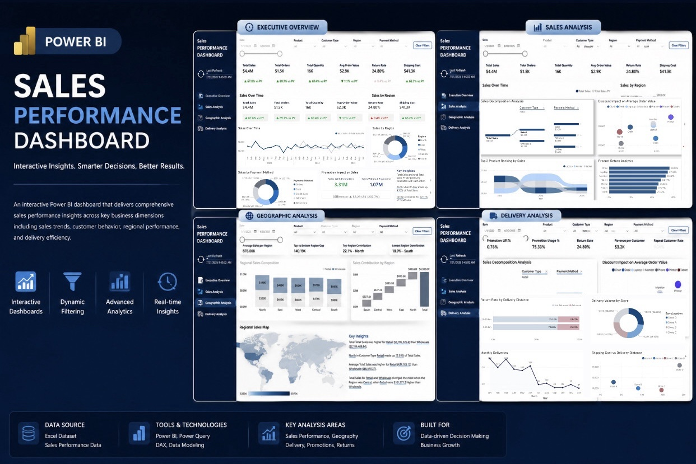

# 📊 Power BI Sales Performance Dashboard



## 📌 Project Overview

This project is an interactive Power BI dashboard designed to analyze sales performance through executive-level reporting and business intelligence. It combines DAX measures, Power Query transformations, and data visualization techniques to help monitor KPIs, regional performance, customer behavior, and delivery operations.

---

## ✨ Dashboard Pages

- 📈 Executive Overview
- 📊 Sales Analysis
- 🌍 Geographic Analysis
- 🚚 Delivery Analysis

---

## 🛠 Technologies Used

- Microsoft Power BI
- DAX
- Power Query
- Excel
- Data Modeling
- Interactive Visualizations

---

## 📂 Repository Structure

```text
Dashboard/
Dataset/
Images/
README.md
```
